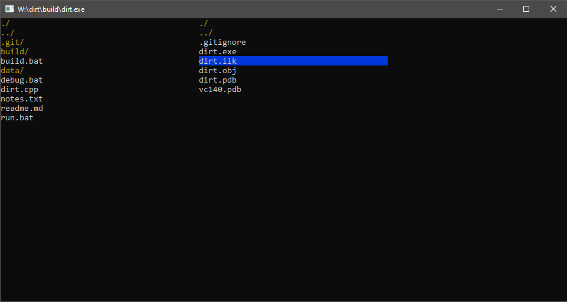

# Dirt
dir(ectory) t(amer)

## Description
**WARNING**: Dirt is still a work in progress, not ready for release.\
Use at your own risk, as certain features might not work as intended yet.

Dirt is a simple and small terminal based file manager\
for windows, with no dependencies.\
Support for other platforms, may happen in the distant future.\
It provides a split view of two directory listings\
that you can easily navigate with the keyboard,\
and lets you operate on both directories and the entries within.

## Images


## Installation
**To install dirt:**
1. Clone this repo, ie. 
```
cd C:/path/to/desired/location
git clone https://github.com/compieler/dirt
```
2. Navigate to cloned repo
```
cd dirt
```
3. Build dirt by running build.bat command (requires visual studio c compiler, CL)
```
build.bat
```
4. Either run the program with the run.bat command, or navigate to the build directory\
and run the executable dirt.exe from there.
```
run.bat
```
or
```
cd build
dirt.exe
```

5. You can move the dirt executable to wherever you like after it is created,\
it has no dependencies, so just move the dirt.exe to where you want.

6. Optionally you can add the path to the dirt executable to you environment\
variables so you can run dirt from anywhere using the command prompt.

## Usage
### Keybindings
| Input | function |
|-------|:--------:|
|**Q** or **Escape**|quit|
|**H** or **Left-Arrow** or **Backspace**|jump out to parent directory|
|**J** or **Down-Arrow**|navigate down one entry|
|**K** or **Up-Arrow**|navigate up one entry|
|**L** or **Right-Arrow**|jump into highlighted directory|
|**Return**|open highlighted file|
|**TAB**|switch to other view/pane|
|**Space**|select/deselect highlighted entry|
|**Shift+Space**|deselect all selected entries|
|**D**|delete selected entries|
|**M**|move selected entries to currently viewed directory|
|**X**|Open command prompt in current directory|
|**E**|Open windows explorer in current directory|
|**R**|Refresh both views|

## Planned features
_More to come_
- Automatic refreshing of views
- Ability to create directories
- Ability to create files
- Presentation of file/directory details, filetype, size, creation date etc.
- Selection marks, to select muliple files with less keypresses
